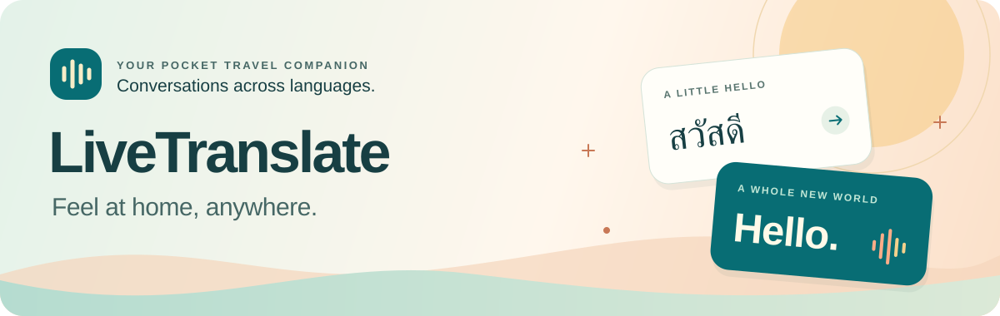
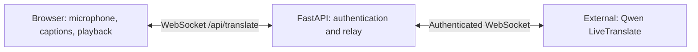

<div align="center">



**Your pocket companion for conversations across languages.**

Live captions for the words around you.<br />
Less guessing. More connection.

[Open LiveTranslate ↗](https://qwen-live-translate.vercel.app) · [The experience](#the-experience) · [Start listening](#start-listening) · [Local setup](#local-setup) · [Development checks](#development-checks)

**60 text languages** &nbsp; · &nbsp; **29 spoken languages** &nbsp; · &nbsp; **Made for your browser**

</div>

---

## A little hello. A whole new world.

The price of mangoes at a market. A recommendation at a café. A question before your spa appointment.

LiveTranslate helps you follow these everyday conversations by turning nearby speech into text you can read in your own language. Open it on your phone, choose a language, and let the microphone listen. Captions update as people speak.

It starts with automatic language detection and English text, ready for moments when someone speaks Thai and you want to understand.

## The experience

|                           | What you get                                                                                      |
| :------------------------ | :------------------------------------------------------------------------------------------------ |
| **Read as they speak**    | Original speech and translated text appear live, without waiting for you to press Stop.           |
| **Follow both languages** | Read the translation alongside the original, with speaker labels to help follow the conversation. |
| **Listen, if you like**   | Turn on spoken translations for supported languages, or keep things quiet with text only.         |
| **Keep the useful words** | Copy the conversation or download a text transcript before you leave.                             |
| **Comfortable on the go** | Large mobile captions, warm colors, and an automatic night theme.                                 |

## Start listening

1. **Open your workspace.** Visit [LiveTranslate](https://qwen-live-translate.vercel.app) and enter your shared password.
2. **Choose your language.** Pick the language you want to read, then allow microphone access.
3. **Tap Start translating.** Hold your phone near the speaker and follow the captions. Tap Stop when you're done.

Each session lasts **four minutes**. Start another whenever you need; earlier text stays in the tab so you can keep reading. A new session starts a fresh conversation and resets speaker labels.

> [!TIP]
> Clear speech makes the difference. For nearby conversations, disconnect your Bluetooth headset and use the phone microphone. Keep the browser visible and your phone unlocked while listening.

## A private space for the moment

Access is protected by a shared password, with no personal account to create. Audio is sent to the translation service to produce captions; the app does not save recordings or transcript history.

Your text stays in the current tab until you clear it, reload or close the page, or sign out. Copy or download anything you want to keep.

## Architecture

The [frontend](frontend/) uses React 19, TypeScript, Vite 7, and custom CSS. The [backend](backend/) uses Python 3.12, FastAPI, Pydantic, and the Python `websockets` library to relay audio and translation events.



The browser captures microphone audio and keeps transcripts in memory. The backend holds the provider API key and connects to `qwen3.8-livetranslate-flash-realtime`. [Vercel configuration](vercel.json) routes `/api/*` to the backend and serves the frontend separately.

## Local setup

Install **Python 3.12**, **uv**, and **Node.js 22.x (22.13 or later) or 24.x**, with npm. Live translation also requires a DashScope API key and workspace access to the configured Qwen model. Microphone capture requires localhost or HTTPS.

### Configure the backend

For a new checkout, run from the repository root:

```sh
cd backend
uv sync --locked
cp .env.example .env
uv run python hash_password.py
uv run python -c "import secrets; print(secrets.token_urlsafe(32))"
```

The password helper prompts for a shared password of at least 12 characters and prints its hash. Copy that hash into `AUTH_PASSWORD_HASH`; use the final command's generated value for `AUTH_SECRET`. Keep the plaintext password for signing in.

Edit `backend/.env` using the included [environment example](backend/.env.example):

| Setting                  | Purpose                                                                                           |
| :----------------------- | :------------------------------------------------------------------------------------------------ |
| `DASHSCOPE_API_KEY`      | Required for translation; use a key with access to your workspace and model.                      |
| `DASHSCOPE_REALTIME_URL` | Set your workspace's `wss://` realtime endpoint without query parameters; the app adds the model. |
| `AUTH_PASSWORD_HASH`     | Required for login; paste the generated Argon2 hash.                                              |
| `AUTH_SECRET`            | Required for session signing; paste the generated secret, at least 32 characters.                 |
| `APP_ORIGINS`            | Keep `http://localhost:5175` for this local setup. Multiple exact origins may be comma-separated. |
| `COOKIE_SECURE`          | Keep `false` for local HTTP development. Use `true` with HTTPS when deployed.                     |

Keep credentials in the ignored `.env` file or deployment environment variables. For deployment, set `APP_ORIGINS` to the exact HTTPS application origin and enable secure cookies.

### Start both processes

In **terminal 1**, from the repository root:

```sh
cd backend
uv run uvicorn main:app --host 127.0.0.1 --port 8175 --reload
```

In **terminal 2**, from the repository root:

```sh
cd frontend
npm ci
npm run dev
```

Open **http://localhost:5175**, sign in with the password you created, and choose a target language. Select **Start translating**, allow microphone access, and speak to receive captions. Use `localhost` to match the configured origin.

The frontend proxies `/api` requests and WebSockets to port `8175`. Opening **http://localhost:5175/api/health** should return `{"status":"ok"}`; this checks the backend connection. Receiving translated captions also requires working provider credentials and access.

## Development checks

Run these commands after installing both applications' dependencies above:

| Directory   | Command                        | Checks                                                          |
| :---------- | :----------------------------- | :-------------------------------------------------------------- |
| `backend/`  | `uv run ruff check .`          | Python linting.                                                 |
| `backend/`  | `uv run ruff format --check .` | Python formatting.                                              |
| `backend/`  | `uv run mypy`                  | Python type checking.                                           |
| `backend/`  | `uv run pytest`                | Backend tests.                                                  |
| `frontend/` | `npm run check`                | TypeScript, ESLint, and Prettier.                               |
| `frontend/` | `npm test`                     | Frontend unit tests.                                            |
| `frontend/` | `npm run build`                | Frontend checks and production assets in `frontend/dist/`.      |
| `frontend/` | `npm run test:browser`         | Browser tests with fake microphone input and a fixture backend. |

Browser tests require Google Chrome and the backend's `.venv`. They start their own processes on ports `5174` and `8174`, which must be available. Automated tests use fixtures; live translation requires a separate check with the provider.

---

<div align="center">

**Good conversations. Great adventures.**

[Open your workspace ↗](https://qwen-live-translate.vercel.app)

</div>
